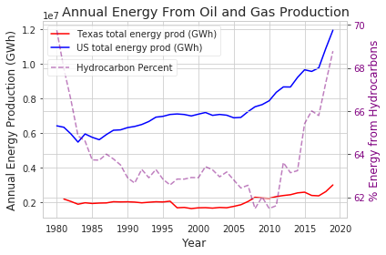
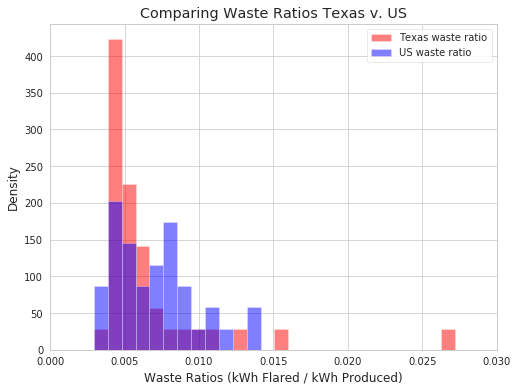

# Created nor Destroyed: An exploratory analysis of energy wasted to flaring natural gas

The goal of this project is to explore and assess the scale of energy flared using publicly available data.  The scale of energy waste will be evaluated based on a normalized ratio, the "Waste Ratio", and will focus specifically on Texas v. the US.  

# Background and Inspiration

Energy is a passion of mine. It drives the global economy and fuels human advancement. I believe it is vital that we improve existing means of energy generation while also focusing on renewables. If we neglect to continue improving existing means of energy generation, we risk missing out on opportunities to share these improvements globally, especially in areas unable to embrace renewables as quickly as the US.  I am often frustrated by the energy industry's common practice of flaring natural gas - the burning of energy that is otherwise too costly to take to market. Natural gas is plentfiul in the US - the Energy Information Administration (EIA) estimates the total reserves in 2018 at 365 Tcf, or 365,000,000,000,000 cubic feet. This is enough energy to supply the entirety of the US energy demand for over 25 years. This gas is usually very difficult and costly to bring to market, even in areas where the infrastructure exists to do so. As we push the bounds of production into areas that do not have infrastructure to bring all produced gas to the market, the problem becomes compounded. 

# Hypothesis
I decided to focus on Texas' energy waste versus the overall waste in the US becuase Texas is, by a wide margin, the state that produces the most energy from hydrocarbons. 

Another driving factor for me is that Texas is the second largest state, and the productive reservoirs are spread across a wide swath of land in West Texas - many of these areas are remote with little or no infrastructure in place to bring the natural gas to market. 
  * Ho : The mean waste ratio for Texas is equivalent to that of the rest of the United States
  * Ha : The mean waste ratio for Texas is not equivalent to that of the rest of the United States
  
This test leveraged the two-tailed Welch's t-test between Texas and the US for reported production and flaring data dating back to 1980. This provided an adequate smaple size for the Central Limit Theorem to hold. Used alpha value of 0.05 as rejection criteria.

# Data

All data for this analysis was scraped from [U.S. Energy Information Administration](https://www.eia.gov/). This site includes every states reported oil and gas production, and the amount of gas vented / flared (wasted). Unfortunately, some states like Pennsylvania, home to massive quantities of natural gas, do not report flaring information. All information regarding the production volumes and flare volumes for every available year was scraped via Beautiful Soup and stashed in a MongoDB database. The databases were separated into collections of oil produced, gas produced, and gas flared for each reporting state. The DBs were read into Python Pandas via PyMongo. From there, Pandas allowed me to clean up the data to be used in my EDA. 

# EDA

After the data was merged and cleaned, I began performing some basic EDA forcusing on some of points of interest. I started by analyzing the bigger picture, and then dove into testing my hypothesis. 

 
 This plot shows the annual energy from oil and gas production of the US versus Texas alone. Also on the graph is the percentage of energy consumed in the US from oil and gas sources. I wanted to display the percentage from these sources as well because it speaks to why my topic is so important. Hydrocarbons, with all their flaws, still dominate our energy spectrum. As we wane off these goods for greener sources, we need to ensure that we still strive to optimize them. It will take decades to switch to fully renewable sources, and even longer for the developing world. This graph emphasizes this point for me.  
 

The above plot depicts the mass scale of the energy waste. Some perspective: 
  * The total amount of energy wasted to flaring since 1980 could power 161 million US homes for a year (based on 2019 consumption average) 
  * The total amount of energy wasted to flaring in 2018 *alone* could power ~12.5 million homes for a year (based on 2019 consumption average)
  * The same energy wasted in 2018 could power a Tesla journey to the sun and back over 3,000 times. (4.1 miles per kWh Tesla average)

# Texas v. U.S. - Testing the Hypothesis
I sliced down the data to only include Texas and the rest of the US, normalized the volumes produced / flared with kWh, and created the ratio of energy wasted / energy produced -the "waste ratio"- a unitless value that provides a useful proving ground for how well Texas is utilizing its energy vs. the rest of the country. 

# Results

Utilmately, the data determined that there is no statistical significance between the wate ratio of Texas compared to the rest of the country. The test generated a p value of 0.53 and I therefore **failed to reject the null hypothesis**. That is, I could not reject the hypothesis that Texas's waste ratio is equal to the rest of the US. While Texas certainly generates the lion's share of energy in this country, thus far it remains unclear how Texas stacks up to the rest of the country. I wanted to see how the waste ratios between Texas and the US changed over time see if we could expect a change going forward. The resulting plot was revealing:

Clearly since about 2012, in line with West Texas production at the heights of the shale revolution, the waste ratio in Texas sky-rocketed. While this ratio still remains small, the waste is still massive. As the US has overtaken Saudi Arabia and Russia as the world's top producers, and as U.S oil companies push further and further into the deserts of Texas removed from market demand, flaring becomes all the more prevalent. This is not a new problem - it has been discussed as a global issue for decades. Its time to re-think how this energy can be used especially in our hyper-connected world and 5G future.  

# Technologies Employed
* Python (Numpy, Matplotlib,Requests, Beautiful Soup, Scipy, Pandas, Seaborn)
* MongoDB
* Amazon Web Services EC2

# Next Steps

The next logical step is to perform multiple statistical tests including Texas vs. specific states. This would give me a better understanding which state best handles their produced gas. More broadly, flaring remains common practice globally. The ultimate goal is to make doing the right thing the most economical choice, and share that technology broadly. 

There are some very interesting solutions that have emerged to better use the energy - including blockchain and Bitcoin mining. Some of the challenges that I can forsee as more people try to make use of this 'free' energy are the remoteness of the flaring locations and their proximity to areas with acess to internet, fiber, 4G/5G, etc. I am very interested at drilling down on this issue, especially in Texas. I can envision levearaging GPS coordinates and proximity tools in Python to map out favorable canditdates for using the gas to power computers / connectivity. 

# Acknowledgements

Thanks to Dan Rupp, Juliana Duncan, and Broderick Turner for their support throughout this project and for keeping me focused.

Also thanks to the US Energy Information Administration for reporting the data. 

